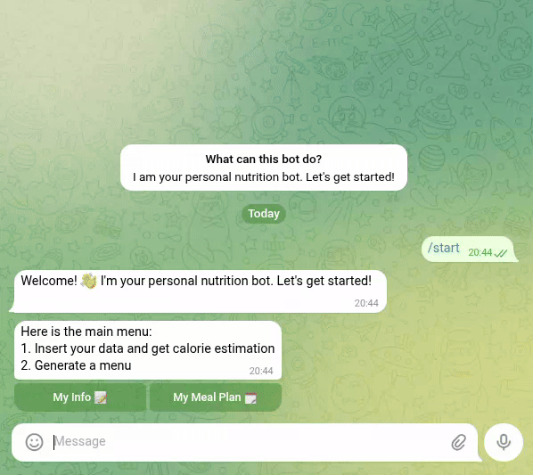

# 🥗 Personal Nutrition Assistant Bot

A smart Telegram bot that creates personalized meal plans and calculates daily calorie needs based on your profile and fitness goals.

## 🎬 Demo

<table>
  <tr>
    <td width="50%" valign="top" align="center">
      <strong>1. Input Your Personal Data</strong><br>
      <em>Provide your information through a conversation.</em><br><br>
      
    </td>
    <td width="50%" valign="top" align="center">
      <strong>2. Generate Your Meal Plan</strong><br>
      <em>Get a complete 7-day meal plan tailored to your goals.</em><br><br>
      
    </td>
  </tr>
</table>

## ✨ Features

- **📊 Calorie Calculation**: Uses the Mifflin-St Jeor equation to calculate your daily calorie needs
- **🍽️ Personalized Meal Plans**: AI-generated 7-day meal plans tailored to your goals
- **👤 Profile Management**: Store and update your personal health information
- **🎯 Multiple Goals**: Support for weight loss, weight gain, and maintenance
- **📱 Interactive Interface**: Easy-to-use button-based navigation
- **💾 Data Persistence**: Saves your profile data locally in CSV format
- **🔄 Menu Navigation**: Browse through your weekly meal plan day by day

## 🤖 How It Works

1. **Create Your Profile**: Enter your basic information (age, weight, height, sex, activity level, goal)
2. **Calculate Calories**: The bot calculates your daily calorie needs using proven formulas
3. **Generate Menu**: AI creates a balanced 7-day meal plan with detailed recipes and portions
4. **Browse & Follow**: Navigate through your personalized meal plan day by day

## 📋 Requirements

- Python 3.8+
- Telegram Bot Token (from [@BotFather](https://t.me/botfather))
- GitHub Token (for AI functionality)

## 🚀 Installation

### 1. Clone the Repository

```bash
git clone https://github.com/saprykins/t_bot_nutritionist
```

```bash
cd t_bot_nutritionist
```


### 2. Create and activate a virtual environment:
**On macOS/Linux:**
```
virtualenv venv
source venv/bin/activate
```
**On Windows:**
```
py -m venv venv
venv\Scripts\activate
```

### 3. Install Dependencies

```bash
pip install -r requirements.txt
```

### 4. Set Up Environment Variables

Create a `.env` file in the project root:

```env
TELEGRAM_BOT_TOKEN=your_telegram_bot_token_here
GITHUB_TOKEN=your_github_token_here
```

#### Getting Your Tokens:

**Telegram Bot Token:**
1. Message [@BotFather](https://t.me/botfather) on Telegram
2. Send `/newbot` command
3. Follow the instructions to create your bot
4. Copy the token provided

**GitHub Token:**
1. Go to GitHub Settings → Developer settings → Personal access tokens
2. Generate a new token with appropriate permissions
3. Copy the token

### 4. Run the Bot

```bash
python main.py
```

## 🏗️ Project Structure

```
nutrition-bot/
├── main.py              # Main bot application
├── user_data.csv        # User data storage (auto-generated)
├── .env                 # Environment variables (create this)
├── requirements.txt     # Python dependencies
└── README.md           # This file
```

## 💡 Usage

### Starting the Bot
1. Send `/start` to your bot on Telegram
2. Follow the interactive prompts to set up your profile


## 🔧 Configuration

### AI Model Configuration
The bot uses GitHub's AI inference service with the `openai/gpt-4.1-nano` model for menu generation.


## 🛠️ Customization

### Changing AI Model
Modify the model parameter in the `generate_menu_callback` function:

```python
model="openai/gpt-4.1-nano"  # Change to your preferred model
```

## 🔒 Security & Privacy

- User data is stored locally in CSV format
- GitHub tokens are used only for AI inference
- All communication is through Telegram's secure API

## 🐛 Troubleshooting

### Common Issues

**Bot doesn't respond:**
- Check if your `TELEGRAM_BOT_TOKEN` is correct
- Ensure the bot is running (`python main.py`)
- Verify your internet connection

**Menu generation fails:**
- Check if your `GITHUB_TOKEN` is valid
- Ensure you have sufficient API quota
- Try again after a few minutes

## 🔮 Future Enhancements

Potential improvements:
- [ ] Database integration (PostgreSQL/MongoDB)
- [ ] Nutrition tracking and logging
- [ ] Recipe difficulty ratings
- [ ] Dietary restriction support (vegan, gluten-free, etc.)
- [ ] Meal prep suggestions
- [ ] Shopping list generation
- [ ] Integration with fitness trackers
- [ ] Multi-language support

---

Made with ❤️ for healthy living! 🌱